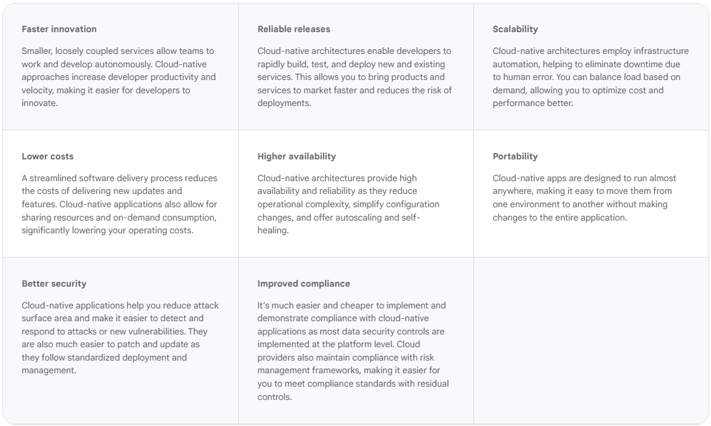

# **Introduction to Cloud Native**

## **What is Cloud Native?**

Cloud native is the software approach of building, deploying, and managing modern applications in cloud computing environments. Modern companies want to build highly scalable, flexible, and resilient applications that they can update quickly to meet customer demands. To do so, they use modern tools and techniques that inherently support application development on cloud infrastructure. These cloud-native technologies support fast and frequent changes to applications without impacting service delivery, providing adopters with an innovative, competitive advantage.

## **Benefits Cloud-native:**

## **Cloud-Native Application Architecture:**

Cloud-native application architecture leverages modern technologies and methodologies to build applications that are scalable, resilient, and manageable in cloud environments. Here’s a concise overview of its key components:

### 1. Microservices

- **Definition**: Microservices architecture decomposes applications into small, independent services, each responsible for a specific business function.
- **Benefits**: This modularity enhances scalability, allows for independent deployment and development, and simplifies maintenance. For instance, companies like **Netflix** and **Amazon** utilize this approach to efficiently manage their services[1][2].

### 2. **Containers & Orchestration:**

- **Containers**: These are lightweight, portable units that encapsulate an application and its dependencies, ensuring consistent deployment across various environments. **Docker** is a widely used container technology.
- **Orchestration**: Tools like **Kubernetes** manage the deployment, scaling, and operation of these containers, facilitating seamless application management in dynamic environments[1][5].

### 3. **DevOps and CI/CD Deployment:**

- **DevOps Practices**: These practices foster collaboration between development and operations teams, promoting automation throughout the software lifecycle.
- **CI/CD Pipelines**: Continuous Integration (CI) and Continuous Delivery (CD) automate building, testing, and deployment processes, which accelerates release cycles and enhances code quality. Popular tools include **Jenkins** and **GitHub Actions**[2][4].

### 4. **APIs and API Gateways:**

- **APIs**: Serve as the communication backbone between microservices, enabling them to interact effectively.
- **API Gateways**: Manage requests between users and services by handling authentication, routing, and load balancing. Tools like **Kong** and **AWS API Gateway** are commonly used for this purpose[1][3].

### 5. **Observability:**

- **Components**: Observability encompasses monitoring (tracking performance metrics), logging (recording system events), and tracing (following requests through microservices).
- **Tools**: Solutions like **Prometheus**, **Grafana**, and the **ELK Stack** provide insights into application health, facilitating quick troubleshooting[2][3].

### 6. **Automation and Infrastructure as Code (IaC):**

- **IaC**: This approach allows developers to define infrastructure through code, ensuring consistency in environment setup.
- **Tools**: Technologies such as **Terraform** and **AWS CloudFormation** automate infrastructure provisioning, enhancing scalability and reducing errors[1][4].

### 7. **Resilience and Scalability:**

- **Design Principles**: Cloud-native applications are built with resilience in mind, employing techniques like redundancy and automated failovers.
- **Auto-scaling**: This feature adjusts resources based on demand automatically, ensuring optimal performance while controlling costs[3][5].

### 8. **Security and Identity Management:**

- Security is integral to cloud-native architecture; it involves implementing measures such as zero-trust principles, encryption, and identity management to protect applications from vulnerabilities[1][4].

This architecture not only supports the rapid development and deployment of applications but also ensures they can adapt to changing business needs while maintaining high availability and performance in cloud environments.

---

## **Cloud Native Tech Stack:**

### **1. Microservices:**

- **Programming Language**: **Python** is the primary language for developing microservices due to its simplicity and versatility, which accelerates the development, testing, and deployment processes.
- **Framework**: **FastAPI** is a high-performance web framework for building APIs in Python. It supports asynchronous requests, provides automatic data validation, and generates interactive API documentation, making it ideal for microservices development[1][2].
- **Service Design**: Each microservice is structured to handle a specific business function, allowing independent deployments and scaling.
- **APIs**: FastAPI facilitates the creation of RESTful APIs for seamless communication between services, enhancing interoperability[2][5].
- **Databases**: Each microservice can utilize its own database (e.g., PostgreSQL for SQL or MongoDB for NoSQL) to ensure data isolation and facilitate easier scaling.
- **Authentication & Authorization**: Security is implemented using **JWT tokens** for authentication and **OAuth2** for authorization, ensuring secure access control to services.
- **Dependency Management**: Tools like **Poetry** or **pipenv** are used to manage dependencies for each microservice, ensuring that each service has the appropriate packages without conflicts.

### **2. Containers and Orchestration:**

- **Containerization**: **Docker** is employed to create, manage, and run containers, packaging applications and their dependencies for portability and consistency across environments.
- **Orchestration Tool**: **Kubernetes** is the primary orchestration tool used to manage, scale, and deploy containerized applications. It automates load balancing, scaling, and deployment processes.
- **Serverless Architecture**: This approach allows developers to build applications without managing server infrastructure directly. Instead, they focus on deploying functions or microservices that consume resources only when in use.

### **3. DevOps and CI/CD Deployment:**

- **DevOps Practices**: Emphasize collaboration between development and operations teams to streamline workflows and improve efficiency.
- **CI/CD Pipelines**: Continuous Integration (CI) and Continuous Delivery (CD) automate the processes of building, testing, and deploying applications. This leads to faster release cycles and improved code quality. Popular tools include:
  - **Jenkins**
  - **GitHub Actions**
  - **CircleCI**

### **4. Monitoring and Observability:**

- Implementing observability tools like **Prometheus**, **Grafana**, and the **ELK Stack (Elasticsearch, Logstash, Kibana)** ensures that developers can monitor application performance, log events, and trace requests across microservices.

### **5. Security:**

- Security practices in cloud-native architectures involve implementing robust identity management solutions, encryption protocols, and regular security audits to protect applications from vulnerabilities.

This comprehensive tech stack enables organizations to build scalable, maintainable cloud-native applications that can adapt quickly to changing business requirements while ensuring high availability and performance.
