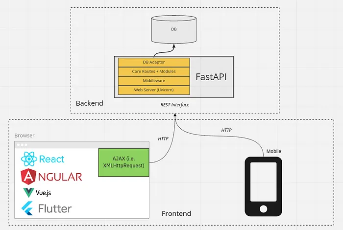

# **FastAPI Detailed Guide:**



## **What is FastAPI:**

FastAPI is a Python web framework that helps you build APIs (Application Programming Interfaces) quickly and easily. It provides a set of tools and features that make it simple to create web applications that can receive and send data over the internet.

## **Characteristics of FastAPI:**

FastAPI is a leading option for API development because of several outstanding features, including:

- **Automatic Documentation:** Based on the type hints and docstrings in your code, FastAPI automatically creates interactive documentation for your API using programs like Swagger UI and ReDoc.
- **Type Hinting:** Built-in Python type hints support guarantees reliable auto-completion and validation in contemporary IDEs, enhancing code dependability.
- **Fast Performance:** One of the quickest Python web frameworks available, FastAPI is built for speed. It takes advantage of nonconcurrent programming to successfully deal with different solicitations immediately.
- **Easy Validation:** Request and input data are automatically verified, which reduces the likelihood of errors. A selection of validation techniques is offered by FastAPI to guarantee data consistency.
- **Authentication and Authorization:** FastAPI supports OAuth2, JWT, and other protocols, making it simple to implement authentication and authorization processes.
- Reliance infusion empowers measured and viable programming by simplifying it to infuse conditions into Programming interface endpoints.

## **Benefits and Drawbacks of FastAPI:**

### **Advantages of FastAPI:**

- **High Performance:** FastAPI offers remarkable performance thanks to its asynchronous features and effective request management.
- **Automatic Documentation:** The documentation is generated automatically, which reduces development time and increases API comprehension.
- **Pythonic:** FastAPI's syntax and methodology are understandable to developers who are familiar with Python.
- **Type Safety:** Type hinting makes code more readable and lowers the risk of runtime problems.

### **Disadvantages of FastAPI:**

- While FastAPI is user-friendly for beginners, grasping its advanced features could necessitate some learning.
- Young Ecosystem: FastAPI's ecosystem is still developing in comparison to more established frameworks like Django.
- Limited Project Templates: Compared to certain other frameworks, FastAPI provides fewer project templates and conventions.

## **Best Practices for Developing FastAPI:**

Consider the following best practices to get the most out of FastAPI:

- **Use Type Hints:** Make use of Python's type hinting to enhance the quality of your code and make the FastAPI validation tools available.
- **Organize Code:** Lay out your project logically by segmenting it into separate modules or packages for your routes, models, and business logic.
- **Middleware:** Middleware can be used to handle universal issues, such as logging, error handling, and request/response modification.
- **Testing:** Create thorough unit and integration tests to make sure your API is reliable.
- Implement secure techniques for authentication and authorization to safeguard your API.

## **Uses of FastAPI:**

FastAPI is flexible and suitable for a range of web development tasks, including:

- **RESTful APIs:** FastAPI is a master at developing RESTful APIs for web and mobile apps.
- **Microservices:** Due to its speed and async features, it is appropriate for constructing microservices.
- **Real-time Applications:** FastAPI is capable of handling real-time applications, such as online gaming and chat programs.
- Interactive data dashboards and reporting tools can be made utilizing the FastAPI.
- For making IoT APIs and directing IoT gadgets, FastAPI is a solid choice.

## **Installation of FastAPI Using Poetry:**

To install FastAPI using **Poetry**, follow these steps:

### 1. **Install Poetry** (if not already installed):

```bash
curl -sSL https://install.python-poetry.org | python3 -
```

### 2. **Create a new project**:

```bash
poetry new my_fastapi_project
cd my_fastapi_project
```

### 3. **Add FastAPI and an ASGI server (like Uvicorn)**:

```bash
poetry add fastapi uvicorn
```

### 4. **Run your FastAPI application**:

Create a file named `main.py` with the following content:

```python
from fastapi import FastAPI

app = FastAPI()

@app.get("/")
async def read_root():
    return {"Hello": "World"}
```

Then run it using:

```bash
poetry run uvicorn main:app --reload
```

## **Core Components of FastAPI:**

FastAPI is built on several core components that enhance its functionality:

- **Routing**: FastAPI uses decorators to define endpoints, allowing you to map HTTP requests to Python functions easily. Each route can handle different HTTP methods (GET, POST, etc.) and can include path and query parameters.

- **Data Validation**: Leveraging Pydantic, FastAPI automatically validates request data against defined models, ensuring type safety and reducing runtime errors.

- **Automatic Documentation**: FastAPI generates interactive API documentation automatically using OpenAPI standards. This includes Swagger UI and ReDoc, making it easy for developers to explore and test the API.

- **Dependency Injection**: FastAPI includes a powerful dependency injection system that allows you to manage dependencies easily across your application, enhancing modularity and reusability.

- **Asynchronous Support**: Built on top of Starlette, FastAPI supports asynchronous programming with `async` and `await`, making it suitable for high-performance applications that require concurrency.

- **Middleware**: You can add middleware to handle requests globally, such as logging or CORS support, enhancing the application's capabilities without modifying individual endpoints.

- **Background Tasks**: FastAPI allows you to run background tasks after returning a response, which is useful for operations that don't need to block the main request-response cycle.

These components work together to make FastAPI a robust framework for building APIs efficiently and effectively.
