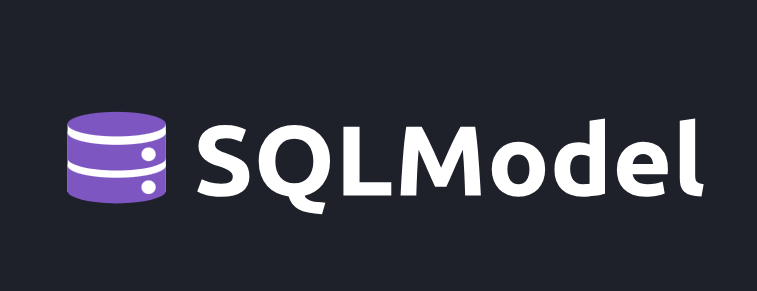

# **Introduction to SQLModel:**

SQLModel is a Python library designed to facilitate interaction with SQL databases using Python objects. It combines the capabilities of SQLAlchemy, an ORM (Object-Relational Mapping) library, and Pydantic, a data validation library, allowing developers to define data models that are both easy to use and robust. SQLModel leverages Python type annotations to create models that can be seamlessly translated into SQL statements for database operations.

## **Simplifying Database Interaction with SQLModel:**

SQLModel simplifies database interaction by providing an intuitive API that reduces boilerplate code. Developers can define their database tables as Python classes, where each class attribute corresponds to a table column. This approach allows for straightforward CRUD (Create, Read, Update, Delete) operations without the need for extensive SQL syntax. The integration with Pydantic ensures that data validation is performed automatically, enhancing data integrity.

## **Use Cases:**

SQLModel is particularly useful in several scenarios:

- **Web Development with FastAPI**: It is designed to work seamlessly with FastAPI, enabling developers to build APIs that interact with databases efficiently.
- **Data Validation**: Automatically validates incoming data against defined schemas, ensuring consistency and correctness.
- **Prototyping**: Accelerates the development process by allowing quick iterations on data models and database interactions.
- **Educational Purposes**: Provides a clear and simple way to teach database concepts through Python code.

## **Key Features and Strengths:**

- **Intuitive Syntax**: Uses Pythonic conventions for defining models and interacting with databases.
- **Type Safety**: Leverages Python's type annotations for better code clarity and error checking.
- **Automatic Data Validation**: Integrates Pydantic for real-time validation of data inputs.
- **Compatibility**: Works well with SQLAlchemy and FastAPI, making it a versatile choice for modern web applications.
- **Reduced Boilerplate**: Minimizes repetitive code, allowing developers to focus on business logic rather than database management.

## **Conclusion:**

SQLModel represents a significant advancement in simplifying database interactions in Python applications. By merging the strengths of SQLAlchemy and Pydantic, it offers a powerful yet user-friendly toolset for developers. Its focus on ease of use, type safety, and automatic validation makes it an ideal choice for both seasoned developers and those new to working with databases.

## Resources:

[1] [SQLModel](https://sqlmodel.tiangolo.com/)

[2] [Introduction to SQLModel](https://nikhilakki.in/an-introduction-to-sqlmodel)

[3] [The Advantages of Using the Latest Versions of FastAPI, Pydantic, and SQLModel](https://python.plainenglish.io/the-advantages-of-using-the-latest-versions-of-fastapi-pydantic-and-sqlmodel-32c9eab049d2)

[4] https://sqlmodel.tiangolo.com/databases/

[5] https://sqlmodel.tiangolo.com

[6] https://github.com/ahmtcnbs/IntroSQLModel

[7] https://www.youtube.com/watch?v=RU6Fk6bmBk8

[8] https://sqlmodel.tiangolo.com/tutorial/fastapi/

[9] https://sqlmodel.tiangolo.com/tutorial/

[10] https://sqlmodel.tiangolo.com/tutorial/many-to-many/
